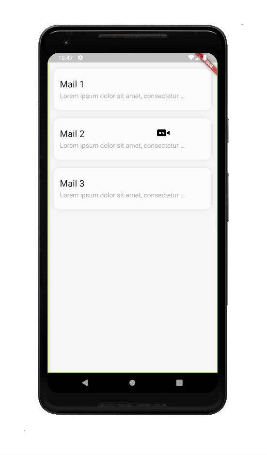
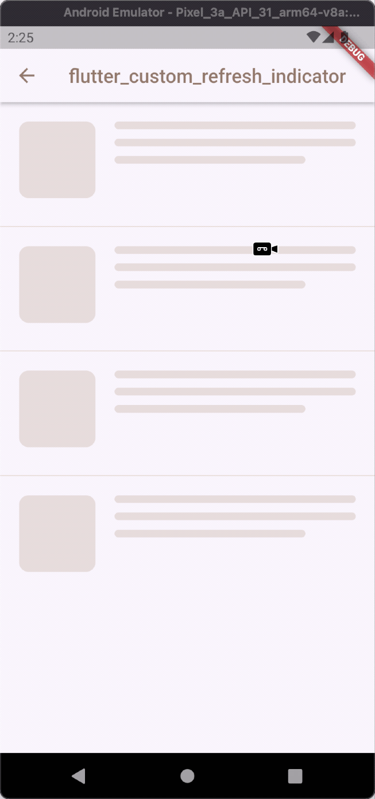

# Flutter Custom Refresh Indicator

[](https://github.com/gonuit/flutter-custom-refresh-indicator/actions/workflows/test.yml)

This package provides `CustomRefreshIndicator` widget that make it easy to implement your own custom refresh indicator. It listens for scroll events from scroll widget passed to child argument and parsing it to data easy for custom refresh indicator implementation. Indicator data is provided by IndicatorController (third argument of builder method). Long story short... thats it!

If there is something that can be improved, fixed or you just have some great idea feel free to open github issue [HERE](https://github.com/gonuit/flutter-custom-refresh-indicator/issues) or open a pull request [HERE](https://github.com/gonuit/flutter-custom-refresh-indicator/pulls).

If you implemented your own custom refresh indicator with this library and you want it to be mentioned here or provided as an example to the eample app, just open a pull request [HERE](https://github.com/gonuit/flutter-custom-refresh-indicator/pulls).

### Table of Contents

- [Flutter Custom Refresh Indicator](#flutter-custom-refresh-indicator)
  - [Table of Contents](#table-of-contents)
- [QUICK START](#quick-start)
- [Examples](#examples)
- [Documentation](#documentation)
  - [CustomRefreshIndicator widget](#customrefreshindicator-widget)
  - [IndicatorController](#indicatorcontroller)
    - [Controller state and value changes.](#controller-state-and-value-changes)
    - [`didStateChange`](#didstatechange)

# QUICK START

```dart
CustomRefreshIndicator(
  /// Scrollable widget
  child: ListView.separated(
    itemBuilder: (BuildContext context, int index) => const SizedBox(
      height: 100,
    ),
    separatorBuilder: (BuildContext context, int index) =>
        const SizedBox(height: 20),
  ),
  /// Custom indicator builder function
  builder: (
    BuildContext context,
    Widget child,
    IndicatorController controller,
    ) {
      /// TODO: Implement your own refresh indicator
      return Stack(
        children: <Widget>[
          AnimatedBuilder(
            animation: controller,
            builder: (BuildContext context, _) {
              /// This part will be rebuild on every controller change
              return MyIndicator();
            },
          ),
          /// Scrollable widget that was provided as [child] argument
          ///
          /// TIP:
          /// You can also wrap [child] with [Transform] widget to also a animate list transform (see example app)
          child,
        ],
      );
    }
  /// A function that's called when the user has dragged the refresh indicator
  /// far enough to demonstrate that they want the app to refresh.
  /// Should return [Future].
  onRefresh: myAsyncRefreshMethod,
)
```

# Examples

Almost all of these examples are available in the example application.

| Plane indicator [[SOURCE CODE](example/lib/indicators/plane_indicator.dart)] | Ice cream indicator [[SOURCE CODE](example/lib/indicators/ice_cream_indicator.dart)] |
| :--------------------------------------------------------------------------: | :----------------------------------------------------------------------------------: |
|                                |                                |

| Warp indicator [[SOURCE CODE](example/lib/indicators/warp_indicator.dart)] |                Envelope indicator                |
| :------------------------------------------------------------------------: | :----------------------------------------------: |
|                                |  |

| Indicator with complete state [[SOURCE CODE](example/lib/indicators/check_mark_indicator.dart)] |                               Your indicator                                |
| :---------------------------------------------------------------------------------------------: | :-------------------------------------------------------------------------: |
|                       | Have you created a fancy refresh indicator? This place is for you. Open PR. |

# Documentation

## CustomRefreshIndicator widget

`CustomRefreshIndicator` widget provides an absolute minimum functionality that allows you to create and set your own custom indicators.

## IndicatorController

### Controller state and value changes.

The best way to understand how the "CustomRefreshIndicator" widget changes its controller data is to see the example 😉. An example is available in the example application.


| state        | value   | value description                                                                                       | Description                                                                                                                                                                                                                              |
| ------------ | :------ | :------------------------------------------------------------------------------------------------------ | :--------------------------------------------------------------------------------------------------------------------------------------------------------------------------------------------------------------------------------------- |
| **idle**     | `==0.0` | Value eqals `0.0`.                                                                                      | No user action.                                                                                                                                                                                                                          |
| **dragging** | `=<0.0` | Value is eqal `0.0` or larger but lower than `1.0`.                                                     | User is dragging the indicator.                                                                                                                                                                                                          |
| **armed**    | `>=1.0` | Value is larger than `1.0`.                                                                             | User dragged the indicator further than the distance declared by `extentPercentageToArmed` or `offsetToArmed`. User still keeps the finger on the screen.                                                                                |
| **loading**  | `>=1.0` | Value decreses from last `armed` state value in duration of `armedToLoadingDuration` argument to `1.0`. | User finished dragging (took his finger off the screen), when state was equal to `armed`. `onRefresh` function is called.                                                                                                                |
| **hiding**   | `<=1.0` | Value decreses in duration of `draggingToIdleDuration` or `loadingToIdleDuration` arguments to `0.0`.   | Indicator is hiding after:<br />- User ended dragging when indicator was in `dragging` state.<br />- Future returned from `onRefresh` function is resolved.<br />- Complete state ended.<br />- User started scrolling through the list. |
| **complete** | `==1.0` | Value equals `1.0` for duration of `completeStateDuration` argument.                                    | **This state is OPTIONAL, provide `completeStateDuration` argument with non null value to enable it.**<br /> Loading is completed.                                                                                                       |

---

### IndicatorStateHelper

With the IndicatorStateHelper class, you can easily track indicator's state changes. Example usage can be found [HERE](example/lib/indicators/check_mark_indicator.dart).
  
All you need to do is to update it's value on every controller update.
```dart
CustomRefreshIndicator(
  onRefresh: onRefresh,
  child: widget.child,
  builder: (
    BuildContext context,
    Widget child,
    IndicatorController controller,
  ) => AnimatedBuilder(
    animation: controller,
    builder: (BuildContext context, Widget? _) {
      /// Now every state change will be tracked by the helper class.
      _helper.update(controller.state);
    // ...
```
Then you can simply track state changes:
```dart
/// When the state changes to [idle]
if(_helper.didStateChange(to: IndicatorState.idle)) {
  // Code...
}

/// When the state changes from [idle] to [dragging]
if (_helper.didStateChange(
  from: IndicatorState.idle,
  to: IndicatorState.dragging,
)) {
  // Code...
}

/// When the state changes from [idle] to another.
if (_helper.didStateChange(
  from: IndicatorState.idle,
)) {
  // Code...
}

/// When the state changes.
if (_helper.didStateChange()) {
  // Code...
}
```
