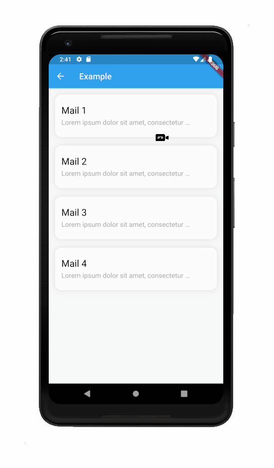
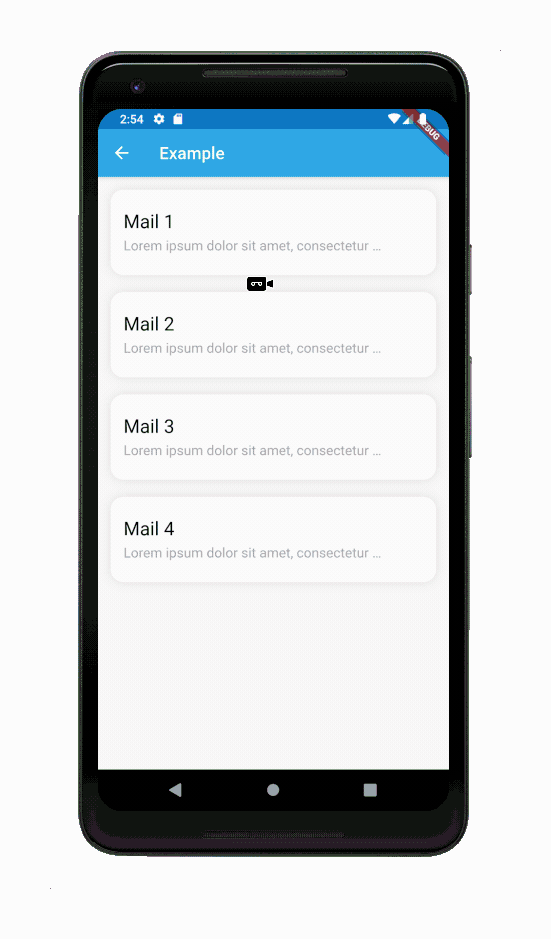

# Flutter Custom Refresh Indicator

This package provides `CustomRefreshIndicator` widget that make it easy to implement your own custom refresh indicator. It listens for scroll events from scroll widget passed to child argument and parsing it to data easy for custom refresh indicator implementation. Indicator data is provided by IndicatorController (third argument of builder method). Long story short... thats it!

If there is something that can be improved, fixed or you just have some great idea feel free to open github issue [HERE](https://github.com/gonuit/flutter-custom-refresh-indicator/issues) or open a pull request [HERE](https://github.com/gonuit/flutter-custom-refresh-indicator/pulls).

If you implemented your own custom refresh indicator with this library and you want it to be mentioned here or provided as an example to the eample app, just open a pull request [HERE](https://github.com/gonuit/flutter-custom-refresh-indicator/pulls).

## QUICK START

### Code

```dart
CustomRefreshIndicator(
  /// Scrollable widget
  child: ListView.separated(
    itemBuilder: (BuildContext context, int index) => const SizedBox(
      height: 100,
    ),
    separatorBuilder: (BuildContext context, int index) =>
        const SizedBox(height: 20),
  ),
  /// Custom indicator builder function
  builder: (
    BuildContext context,
    Widget child,
    IndicatorController controller,
    ) {
      /// TODO: Implement your own refresh indicator
      return Stack(
        children: <Widget>[
          AnimatedBuilder(
            animation: controller,
            builder: (BuildContext context, _) {
              /// This part will be rebuild on every controller change
              return MyIndicator();
            },
          ),
          /// Scrollable widget that was provided as [child] argument
          ///
          /// TIP:
          /// You can also wrap [child] with [Transform] widget to also a animate list transform (see example app)
          child,
        ],
      );
    }
  /// A function that's called when the user has dragged the refresh indicator
  /// far enough to demonstrate that they want the app to refresh.
  /// Should return [Future].
  onRefresh: myAsyncRefreshMethod,
)
```

### How the controller data change

The best way to understand how the "CustomRefreshIndicator" widget changes its controller data is to see the example 😉. An example is available in the example application.
  


## Examples

Almost all of these examples are available in the example application.

### Plane indicator [[SOURCE CODE](example/lib/indicators/plane_indicator.dart)]


### Ice cream indicator [[SOURCE CODE](example/lib/indicators/ice_cream_indicator.dart)]


### Simple indicator made with `PositionedIndicatorContainer` [[SOURCE CODE](example/lib/indicators/simple_indicator.dart)]



### Envelope indicator


### Emoji indicator [[SOURCE CODE](example/lib/indicators/emoji_indicator.dart)]

You can create any indicator you want!



## CustomRefreshIndicator widget

`CustomRefreshIndicator` widget provides an absolute minimum functionality that allows you to create and set your own custom indicators.

## IndicatorState

Enum which describes state of CustomRefreshIndicator. It is provided by IndicatorController.

#### `idle`

CustomRefreshIndicator is idle (There is no action)

```dart
controller.value == 0.0
```

#### `dragging`

Whether the user is dragging a scrollable widget.  
Ending the scroll **WILL NOT** result in `onRefresh` function call

```dart
controller.value < 1.0
```

#### `armed`

CustomRefreshIndicator is armed ending the scroll **WILL** result in:

- `onRefresh` function call
- change of indicator status to `loading`
- decreasing controller.value to `1.0` in duration specified by `armedToLoadingDuration` CustomRefreshIndicator widget argument

```dart
controller.value >= 1.0
```

#### `hiding`

CustomRefreshIndicator is hiding its indicator. After the future returned from `onRefresh` function is completed or scroll ended when the state was equal to `dragging` or the user started scrolling through the list.
controller value decreases to `0.0` in duration specified by `draggingToIdleDuration` CustomRefreshIndicator widget argument.

```dart
controller.value <= 1.0
```

#### `loading`

CustomRefreshIndicator widget is awaiting on future returned from `onRefresh` function. After future completed state will be change into `hiding` and controller value will decrease from `1.0` to `0.0` in duration specified by `loadingToIdleDuration` CustomRefreshIndicator widget argument.

```dart
controller.value == 1.0
```
