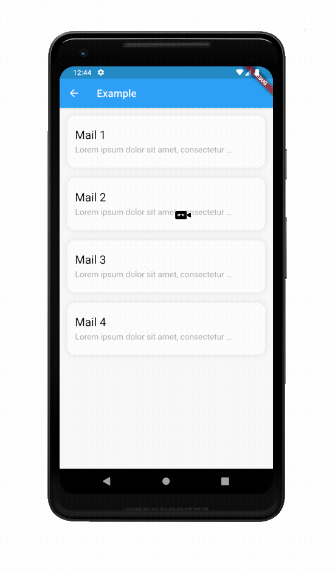
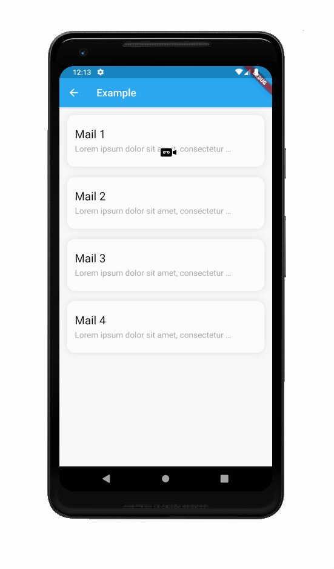

# Flutter Custom Refresh Indicator

- [Flutter Custom Refresh Indicator](#flutter-custom-refresh-indicator)
  - [Examples:](#examples)
    - [Use of `SimpleIndicatorContainer` with `Icon` as child LINK](#use-of-simpleindicatorcontainer-with-icon-as-child-link)
    - [Envelope indicator](#envelope-indicator)
    - [Blur indicator](#blur-indicator)
  - [Getting started](#getting-started)
    - [`CustomRefreshIndicator`](#customrefreshindicator)
      - [Arguments](#arguments)
    - [`CustomRefreshIndicatorData`](#customrefreshindicatordata)
      - [Props](#props)
    - [`CustomRefreshIndicatorState`](#customrefreshindicatorstate)
      - [Props](#props-1)

This package adds `CustomRefreshIndicator` widget that make it easy to implement custom refresh indicator.

## Examples:

### Use of `SimpleIndicatorContainer` with `Icon` as child [LINK](example/lib/indicators/simple_indicator.dart)  

### [Envelope indicator](https://pub.dev/packages/letter_refresh_indicator)  

### [Blur indicator](example/lib/indicators/blur_indicator.dart) 

## Getting started

### `CustomRefreshIndicator`
`CustomRefreshIndicator` is not the same as the` RefreshIndicator` widget. It has an absolute minimum functionality that allows you to create and set your own custom indicators.

#### Arguments
| Argument                   | type           | default value   | required                                                                                                  |
| :--- | :--- | :---| :--- |
| child                    | `Widget`        | --- | true |      |
| onRefresh         | `Future<void> Function()` | --- | true |                                                                                               |
| indicatorBuilder         | `Widget Function(BuildContext, CustomRefreshIndicatorData)`             | --- | true |   |
| dragingToIdleDuration            | `Duration`            | `Duration(milliseconds: 300)`            | false |                                                                                                   |
| armedToLoadingDuration           | `Duration`            | `Duration(milliseconds: 200)`         | false |                                                                                                     |
| loadingToIdleDuration           | `Duration`            | `Duration(milliseconds: 100)`          | false |                                                                                                    |
| leadingGlowVisible    | `bool`       | `false`        | false |                                                                                                      |
| trailingGlowVisible         | `bool`       | `true`      | false |                                                                                                        |

### `CustomRefreshIndicatorData`
Object containig data provided by `CustomRefreshIndicator`.

#### Props
| prop                   | type           |  
| :--- | :--- |
| value                    | `double` |   
| direction         | `AxisDirection` |   
| scrollingDirection         | `ScrollDirection`             |   
| indicatorState            | `CustomRefreshIndicatorState`            |   

### `CustomRefreshIndicatorState`
Enum which describes state of CustomRefreshIndicator.

#### Props
| value                   | description           |   
| :--- | :--- |  
| idle                    | Indicator is idle        |   
| draging         | user is draging indicator |   
| armed         | Indicator is dragged enough to be trigger `onRefresh` action            |   
| hiding            | hiding indicator when `onRefresh` action is done or indicator was canceled            |   
| loading            | `onRefresh` action is pending      |   
