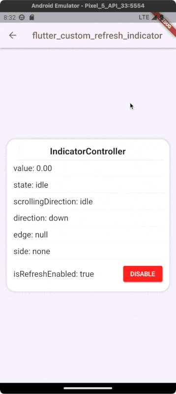

# Custom Refresh Indicator

[](https://github.com/gonuit/flutter-custom-refresh-indicator/actions/workflows/test.yml)

Create your own custom refresh indicator widget in the blink of an eye!

### **TLDR; [ONLINE DEMO](https://custom-refresh-indicator.klyta.it)**!

---

## QUICK START

```dart
CustomRefreshIndicator(
  /// Scrollable widget
  child: ListView.builder(
    itemBuilder: (BuildContext context, int index) => Text(index.toString()),
  ),
  /// The function that builds the indicator
  builder: (
    BuildContext context,
    Widget child,
    IndicatorController controller,
    ) {
      /// TODO: Implement your own refresh indicator
      return Stack(
        children: <Widget>[
          /// The scroll widget that was passed as the [child] argument.
          ///
          /// TIP:
          /// You can also wrap [child] with the [Transform] widget to also animate the list transformation (see the example app).
          child,

          /// Your indicator implementation
          return MyIndicator(value: controller.value, loading: controller.state.isLoading);
        ],
      );
    }
  /// A function that is called when the user drags the refresh indicator
  /// far enough to show that they want to refresh the list.
  /// Should return [Future].
  onRefresh: myAsyncRefreshMethod,
)
```

# Examples

Almost all of these examples are available in the example application.

| Plane indicator [[SOURCE](example/lib/indicators/plane_indicator.dart)][[DEMO](https://custom-refresh-indicator.klyta.it/#/plane)] | Ice cream [[SOURCE](example/lib/indicators/ice_cream_indicator.dart)][[DEMO](https://custom-refresh-indicator.klyta.it/#/ice-cream)] | Warp [[SOURCE](example/lib/indicators/warp_indicator.dart)][[DEMO](https://custom-refresh-indicator.klyta.it/#/warp)] |
| :--------------------------------------------------------------------------------------------------------------------------------: | :----------------------------------------------------------------------------------------------------------------------------------: | :-------------------------------------------------------------------------------------------------------------------: |
|                                                                                      |                                                                                |                                                                           |

| With complete state [[SOURCE](example/lib/indicators/check_mark_indicator.dart)][[DEMO](https://custom-refresh-indicator.klyta.it/#/check-mark)] | Pull to fetch more [[SOURCE](example/lib/indicators/swipe_action.dart)][[DEMO](https://custom-refresh-indicator.klyta.it/#/fetch-more)] | Envelope [[SOURCE](example/lib/indicators/envelope_indicator.dart)][[DEMO](https://custom-refresh-indicator.klyta.it/#/envelope)] |
| :----------------------------------------------------------------------------------------------------------------------------------------------: | :-------------------------------------------------------------------------------------------------------------------------------------: | :-------------------------------------------------------------------------------------------------------------------------------: |
|                                                                        |                                                                                                     |                                                                               |

| Programmatically controlled [[SOURCE](example/lib/screens/programmatically_controlled_indicator_screen.dart)][[DEMO](https://custom-refresh-indicator.klyta.it/#/programmatically-controlled)] |                                                                 Your indicator                                                                  |                                                                 Your indicator                                                                  |
| :--------------------------------------------------------------------------------------------------------------------------------------------------------------------------------------------: | :---------------------------------------------------------------------------------------------------------------------------------------------: | :---------------------------------------------------------------------------------------------------------------------------------------------: |
|                                                                                                                          | Have you created a fancy refresh indicator? This place is for you. [Open PR](https://github.com/gonuit/flutter-custom-refresh-indicator/pulls). | Have you created a fancy refresh indicator? This place is for you. [Open PR](https://github.com/gonuit/flutter-custom-refresh-indicator/pulls). |

___
# Documentation

## CustomRefreshIndicator

The _CustomRefreshIndicator_ widget provides an absolute minimum functionality that allows you to create and set your own custom indicators.

### child (Widget)
The widget tree that contains scrollable widget (eg. *ListView*).
### builder (IndicatorBuilder)
Function that builds the custom refresh indicator.

### onRefresh (AsyncCallback)
A function that is called when the user drags the refresh indicator far enough to trigger a "pull to refresh" action.

### controller (IndicatorController?)
The indicator controller stores all the data related to the refresh indicator widget. It will be passed as the third argument to the *builder* function.
  
If not specified, it will be created by the *CustomRefreshIndicator* widget.

### onStateChanged

The _onStateChanged_ function is called whenever _IndicatorState_ has changed.  
This is a convenient way to track changes in the state of the indicator. For reference, take a look at [example checkmark indicator widget](example/lib/indicators/check_mark_indicator.dart).

Example usage:

```dart
CustomRefreshIndicator(
  onRefresh: onRefresh,
  // You can track state changes here.
  onStateChanged: (IndicatorStateChange change) {
    if (change.didChange(from: IndicatorState.dragging, to: IndicatorState.armed)) {
      // Do something...
    } else if(change.didChange(to: IndicatorState.idle)) {
      // Do something...
    }
    // And so on...
  }
  // ...
)
```
### indicatorCancelDuration (Duration)
Duration of hiding the indicator when dragging was stopped before the indicator was armed (the *onRefresh* callback was not called).
  
The default is 300 milliseconds.
### indicatorSettleDuration (Duration)
The time of settling the pointer on the target location after releasing the pointer in the armed state. During this process, the value of the indicator decreases from its current value, which can be greater than or equal to *1.0* but less or equal to *1.5*, to a target value of *1.0*.
  
The default is 150 milliseconds.

### indicatorFinalizeDuration (Duration)
Duration of hiding the pointer after the *onRefresh* function completes.
  
During this time, the value of the controller decreases from *1.0* to *0.0* with a state set to *IndicatorState.finalizing*.
  
The default is 100 milliseconds.

### completeStateDuration (Duration?)
The duration the indicator remains at value *1.0* and the *IndicatorState.complete* state after the [onRefresh] function completes.
  
This value is optional, specifying it will enable the optional *IndicatorState.complete* state.

### notificationPredicate (ScrollNotificationPredicate)
Determines whether the received [ScrollNotification] should be handled by this widget.
  
By default, it only accepts *0* depth level notifications. This can be helpful for more complex layouts with nested scrollviews.

### leadingScrollIndicatorVisible (bool)
Whether to display leading scroll indicator (glow or stretch effect).
### trailingScrollIndicatorVisible (bool)
Whether to display trailing scroll indicator (glow or stretch effect).

### offsetToArmed (double?)
The distance in number of pixels that the user should drag to arm the indicator. The armed indicator will trigger the *onRefresh* function when the gesture is completed.
  
If not specified, *containerExtentPercentageToArmed* argument will be used instead.

### containerExtentPercentageToArmed (double)
The distance the user must scroll for the indicator to be armed, as a percentage of the scrollable's container extent.
  
If the *offsetToArmed* argument is specified, it will be used instead, and this value will not take effect.
  
The default value equals `0.1(6)`.

### trigger (IndicatorTrigger)
Defines the trigger for the pull to refresh gesture.
| value         | Description                                                                                                                                                                |
| ------------- | :------------------------------------------------------------------------------------------------------------------------------------------------------------------------- |
| **startEdge** | Pull to refresh can be triggered only from the **start** edge of the list. Mostly top side, but can be bottom for reversed ListView (with *reverse* argument set to true). |
| **endEdge**   | Pull to refresh can be triggered only from the **end** edge of the list. Mostly bottom, but can be top for reversed ListView (with *reverse* argument set to true).        |
| **bothEdges** | Pull to refresh can be triggered from **both edges** of the list.                                                                                                          |

### triggerMode (IndicatorTriggerMode)
Configures how *CustomRefreshIndicator* widget can be triggered. Works in the same way as the triggerMode of the built-in *RefreshIndicator* widget.
  
Defaults to *IndicatorTriggerMode.onEdge*.

| value        | Description                                                                                                |
| ------------ | :--------------------------------------------------------------------------------------------------------- |
| **anywhere** | The indicator can be triggered regardless of the scroll position of the *Scrollable* when the drag starts. |
| **onEdge**   | The indicator can only be triggered if the *Scrollable* is at the edge when the drag starts.               |

### autoRebuild (bool)
When set to *true*, the *builder* function will be triggered whenever the controller changes. This can be useful for optimizing performance in complex widgets. When setting this to *false*, you can manage which part of the ui you want to rebuild, such as using the *AnimationBuilder* widget in conjunction with *IndicatorController*.
  
The default is *true*.

___

## IndicatorController

The best way to understand how the _CustomRefreshIndicator_ widget changes the data of its controller is to look at the example 😉.
Open the sample application and try it yourself ([online example](https://custom-refresh-indicator.klyta.it/#/presentation)).

[](https://custom-refresh-indicator.klyta.it/#/presentation)  

### state
The following table describes each state of the indicator controller.

| value          | Description                                                                                                                                                                                                                        |
| -------------- | :--------------------------------------------------------------------------------------------------------------------------------------------------------------------------------------------------------------------------------- |
| **idle**       | In this state, the indicator is not visible. No user action is performed. Value remains at *0.0*.                                                                                                                                  |
| **dragging**   | The user starts scrolling/dragging the pointer to refresh. Releasing the pointer in this state will not trigger the *onRefresh* function. The controller value changes from *0.0* to *1.0*.                                        |
| **canceling**  | The function *onRefresh* **has not been executed**, and the indicator is hidding from its current value that is lower than *1.0* to *0.0*.                                                                                         |
| **armed**      | The user has dragged the pointer further than the distance declared by *containerExtentPercentageToArmed* or *offsetToArmed* (over the value of *1.0*). Releasing the pointer in this state will trigger the *onRefresh* function. |
| **loading**    | The user has released the indicator in the armed state. The indicator settles on its target value *1.0* and the *onRefresh* function is called.                                                                                    |
| **complete**   | **OPTIONAL** - Provide `completeStateDuration` argument to enable it. The *onRefresh* callback has completed and the pointer remains at value *1.0* for the specified duration.                                                    |
| **finalizing** | The *onRefresh* function **has been executed**, and the indicator hides from the value *1.0* to *0.0*.                                                                                                                             |

---

### edge (IndicatorEdge?)
Whether the pull to refresh gesture is triggered from the start of the list or from the end.
  
This is especially useful with the *trigger* argument set to `IndicatorTrigger.bothEdges`, as the gesture can then be triggered from start and end edge.
  
It is null when the edge is still not determined by the *CustomRefreshIndicator* widget.
| value     | Description                                               |
| --------- | :-------------------------------------------------------- |
| **start** | The indicator was started from the beginning of the list. |
| **end**   | The indicator was started from the end of the list.       |

### side (IndicatorSide)
The side of the scrollable on which the indicator should be displayed.
| value      | Description                                                            |
| ---------- | :--------------------------------------------------------------------- |
| **top**    | The indicator should be displayed on the **top** of the scrollable.    |
| **bottom** | The indicator should be displayed on the **bottom** of the scrollable. |
| **left**   | The indicator should be displayed on the **left** of the scrollable.   |
| **right**  | The indicator should be displayed on the **right** of the scrollable.  |
| **none**   | The indicator should not be displayed.                                 |
### direction (AxisDirection)
The direction in which the list scrolls. 

### scrollingDirection (ScrollDirection)
The direction in which the user scrolls.

___

### Support

If you like this package, you have learned something from it, or you just don't know what to do with your money 😅 just buy me a cup of coffee ☕️ and this dose of caffeine will put a smile on my face which in turn will help me improve this package. Also as a thank you, you will be mentioned in this readme as a sponsor.

<div align="center">
<a href="https://www.buymeacoffee.com/kamilklyta" target="_blank"></a>
</div>
<p align="center">Have a nice day! 👋</p>
